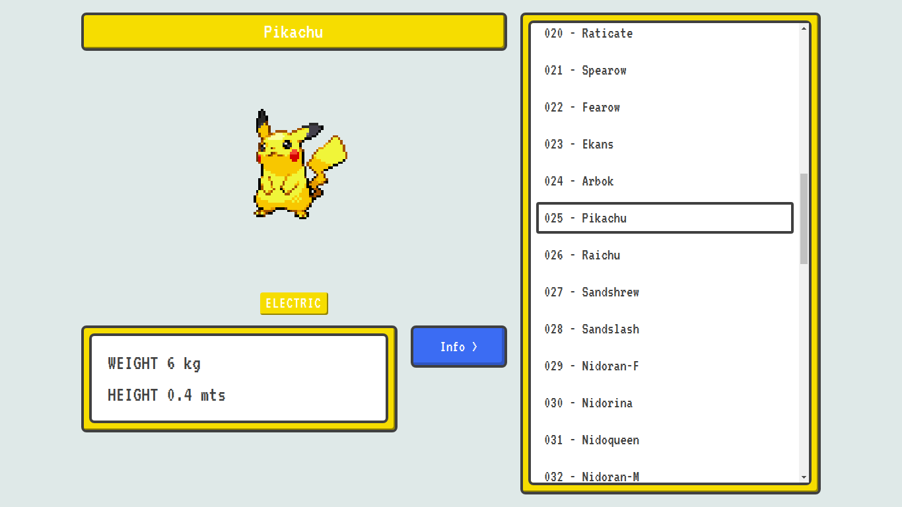

# React Pokédex

A Pokédex is an electronic device built to catalog and provide information about different species of pokémons that exist around the world.

And, why I'm made this project:

- I just discovered a free api name [PokéApi](https://pokeapi.co/), that have informations about almost all pokémons and pokeuniverse;
- This project is a way that i can improve my frontend abilities;
- I'm a pokemon fan since childhood.

## Table of Contents

- [React Pokédex](#react-pokédex)
- [Built With](#built-with)
- [Features](#features)
- [UI Prototype](#ui-prototype)
- [Usage](#usage)
  - [Demo](#demo)

Created by [gh-md-toc](https://github.com/ekalinin/github-markdown-toc)

## Built With

the following technologies has been used to build this application 

- [React JS](http://reactjs.org/)
- [Typescript](https://www.typescriptlang.org/)
- [Styled-Components](https://styled-components.com/)

## Features

- [x] List pokemons
- [ ] Show informations about one pokemon (Abilities, moves, battle status).
- [ ] Add pokemon to favorites
- [ ] Show favorite pokemons

## UI Prototype

- [Figma](https://www.figma.com/file/lAu8IKqmoLLpCcuAEjtgzJ/pokedex-online?node-id=0%3A1)

## Usage 
### Demo

The demo is online on: [react-pokedex](https://react-pokedex-seven.vercel.app/)

**🚧  React Pokédex - Under Construction 🚧**
